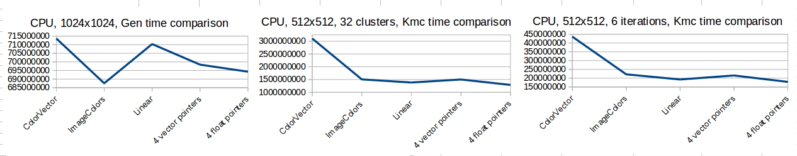
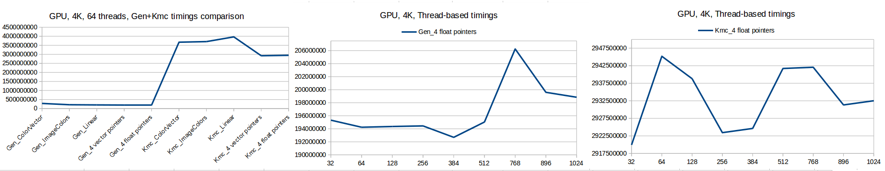
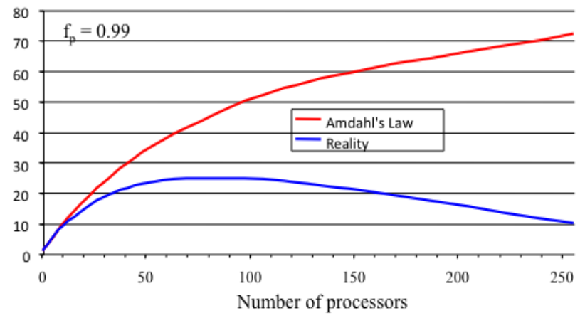

# **Image based K-Means Clustering**
Original repo: https://github.com/RenatsB/clustering

This project was created using **C++** and **CUDA** to evaluate how different data types, layout and parallellism affect performance of a program. What this program does is it generates a series of noise maps based on the used data type, and then it filters each of them using matching **K-Means clustering** algorithm. A typical output can be seen below:


 Generator output using a vector of Color data structures")

 Clustering output using a vector of Color data structures")

---

## **Project Overview**
This Project was developed as a third year programming assignment, the brief required to implement a working serial algorithm and write it in parallel using CUDA. I chose image generation and clustering because I like working with colours and it gave me freedom in choosing the underlying data types. Also, I wanted it to be as simple as possible, so it could simply be launched from a terminal without the need for GUI.

---
## **Configuration**
Following environment variables are needed to compile this out of the box:
```
CUDA_PATH : Needs to point to the base directory of your cuda lib and includes

CUDA_ARCH : Your local device compute (e.g. 30 or 52 or whatever)

HOST_COMPILER : Your local g++ compiler (compatible with cuda compiles, g++ 4.9)
```
In order to compile and run the application:
```
cd <path_to_project>/clustering
Qmake
make
./demo/KMeansClustering
```

---
## **Dependencies**
```
OpenImageIO (preferably 9.0 or higher) - used to output data to images
CUDA - used to accelerate the algorithm in parallel
Google Test - used to test the correctness of the implementation
Google Benchmark - used to measure the speed-ups
```
---
## **Project Structure**
The project is divided in:

```
clib (i.e. Clustering Library)
  clibs (Serial)
  clibp (Parallel)
demo
test
  CPUtest
  GPUtest
  benchmark
    benchCPU
    benchGPU
```
### **Library (clib):**
In turn, the library itself is divided into two parts:
* **clibs** - Clustering Library Serial (CPU implementation in C++)
* **clibp** - Clustering Library Parallel (GPU implementation in CUDA)

Both libraries share the same core principle, they are split into:
* Generator
* Clustering filter

Serial implementation also contains a custom random number generator wrapper and data structure definitions, so **clibp** depends on **clibs**.

Both libraries compile into shared libraries and are stored in the parent folder (**clib**).

**clibs** is class-based, while **clibp** is just a collection of methods within a custom namespace.

### **Demo:**
A simple project with no UI that uses the two libraries and runs the algorithm, outputting the results after each step.

### **Test:**
This project's sole purpose is to check that every component works correctly.

### **Benchmark:**
Found inside test folder, this small project is used to measure the speed-ups.

### *Common*
Files marked common are convenience .pro extensions that are stored in root folder and are used across several subprojects. These files include the linking of CUDA and C++ to ensure everything compiles and works correctly and that these things are the same throughout all of the project.

---

## **Implementation**
Because of the simplicity of the project and at the same time repetitiveness, I had to come up with some kind of custom naming conventions to easily distinguish between different implementations of the same thing.
#### Naming conventions

Function names in this library have certain naming conventions for ease of use.

Image generation and kmeans clustering functions use the following naming structure:
```
<name>_<type>_<processing type>
```
* \<name\> refers to actual name of the method, without any additional types.
* \<type\> refers to CPU/GPU or in other words serial/parallel
* \<processing type\> refers to data structure the method performs operations on.

```
<processing type>:
CV - ColorVector (vector of Color)
IC - ImageColors (Structure of float vectors)
LN - Linear (single vector of floats)
4SV - 4 Std::Vectors of floats
4LV - 4 pointers to vectors
```
#### **Workflow**

The first thing I had to do was to create a working noise map generator to use with the clustering algorithm. Because it was not the most important part of the project, I simply created the first prototype without testing and benchmarking. It was a single method that used just one data type.

Once the requred component was done, I moved on to clustering and implemented the first filter.

Thinking ahead, I decided it would be interesting to see, how different data types may affect the performance, so I added additional versions both to the generator and the filter.

Once that was done, I moved on to testing to see if everything works correctly, which helped me to solve a few problems on the way. During this process I also made several changes to the original algorithms to ensure everythings works as intended.

Profiling was done parallel to testing, so not only was I able to identify faults in code, but also to find out and try what can make it go quicker.

I do realize that test-driven approach can be more effective and save time at later stages, but as simple the project is, it was more a matter of seeing the results first and finding more motivation than diving into making it pretty from the start.

---

## **The K-Means Clustering image filter**
### **Structure**
Although serial implementation is based on a class tructure, GPU version is simplified, because all this project is is a collection of similar methods that do same things with different data. I wrapped the parallel methods into a namespace to distinguish between CPU and GPU when using the library. This meant that I could take advantage of CUDA's performance while keeping a high level readable interface.

### **Comments**
Moving the methods from serial to parallel provided different speed-ups. Although not the fastest, I decided to store data that was commonly used in global memory which was enough for the required problem.

Since Kernels are launched asynchronously, to avoid mutexes, I decided to make cluster picking semi-serial and quickly run through pixels in parallel.
This could be done with shared memory, but because each step depends on all previous steps, I would need to queue threads anyway, which could potentially lead to overheads.

I tried using curand for the parallel implementation, but it proved overly complex and did not have an option for weighted (probability) based distribution, so I had to find a workaround.

The parallel implementation of the algorithm is definitely faster than the serial version, however both of them are far from being perfect.

The algotithm could be improved, adding a data-oriented approach, optimising for intrinsics. The 4 vector versions are a step in that direction, but I decided not to bother with intrinsics at this time. Additionally, shared memory and proper GPU occupancy should be empolyed to spped up the algorithm. Something else to think about would be avoiding atomics as they can also slow down the program.

---
## **Results**
Benchmarked on:
```
GPU: NVIDIA Quadro M4000/PCIe/SSE2 (1664 CUDA Cores)

CPU: Intel® Xeon(R) CPU E5-1650 v3 (12 X 3800 MHz CPUs)
```

I do not provide the tables in this readme, but all tables with time measurements can be found in either [benchmarks.xml](./benchmarks.xml), [benchmarks.odf](./benchmarks.odf), [benchmarks.csv](benchmarks.csv) or raw [buffer.txt](./buffer.txt) all found in root folder of the project.

Here I only provide graphs showing average performance of the program.

Below you can find a short comparison that shows how different data types used in this project affect the performance on the algorithm.



 Generator and Clustering implementation. Run speed comparison using different data types")

Parallel (GPU) Generator and Clustering implementation. Tests in 4k. First graph showing comparison between different data type performances in generation and filtering. Second and third graphs show how thread number affects performance on an example of 4 vectors approach.


---
## **Conclusion**
In terms of generation, speedup is massive. But here it is just a matter of filling up the vectors quickly. In terms of K-Means clustering, the speedup is quite small, and data type performace tendencies are actually opposite across CPU and GPU. Thread tendency can be seen in 4k thread testing, where on average, optimal performance is reached around 384 threads (seen in middle graph). Everything before or after is slower.

An interesting graph produced by using 4 float pointers as an input (right graph), shows that a small number of threads is actually as optimal as the general medium of 384. This might be a result of semi-serial cluster picking approach used by the algorithm, and because the communication overhead between cpu and gpu is higher than the speedups. First it slows down as the number increases from the start, then after the optimal value it seems to reach a plateau or even decrease again. Both the general tendency and this exception seem to follow the trend of the blue line of the graph below.



---
## **References:**

https://lodev.org/cgtutor/randomnoise.html
https://github.com/albelax/TexGen/blob/master/src/Image.cpp
https://lodev.org/cgtutor/index.html
http://www.cplusplus.com/reference/random/uniform_real_distribution/
https://stackoverflow.com/questions/1008019/c-singleton-design-pattern
https://stackoverflow.com/questions/22387586/measuring-execution-time-of-a-function-in-c
https://devtalk.nvidia.com/default/topic/1014332/jetson-tx2/data-sharing-between-c-and-cuda-programs/
https://github.com/OpenImageIO/oiio/blob/release/src/doc/openimageio.pdf
https://github.com/marcoscastro/kmeans/blob/master/kmeans.cpp
http://aresio.blogspot.com/2011/05/cuda-random-numbers-inside-kernels.html
https://github.com/albelax/StableFluids/blob/master/SolverGpu/cudasrc/rand_gpu.cu
https://nidclip.wordpress.com/2014/04/02/cuda-random-number-generation/
https://en.wikipedia.org/wiki/K-means%2B%2B
https://www.clear.rice.edu/comp422/resources/cuda/html/curand/device-api-overview.html#distributions
http://www.icl.utk.edu/~mgates3/docs/cuda.html
